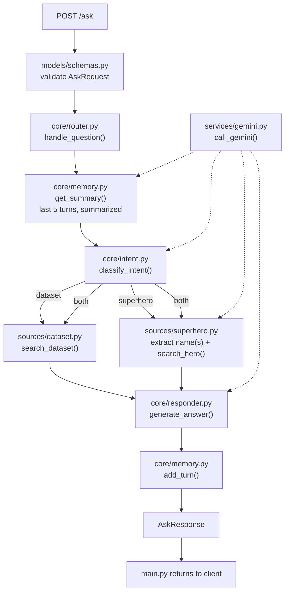

# Project Overview

FastAPI chatbot (`POST /ask`) answering questions from a local text dataset and the Superhero
API, routing via LLM classification, with sources cited in every response. Assessment spec:
`ai_engineer_assessment_v2.2 (1) (2026).pdf`.

## Current features

Every dashed arrow is a Gemini call, all going through the single `call_gemini()` entry point.
`init.sh` bootstraps a run from scratch (checks OS/Python version, creates `.venv`, installs
`requirements.txt`, verifies `.env`) but isn't part of the request flow above.

Key design choices:
- **Config**: `SUPERHERO_API_TOKEN`, `GEMINI_API_KEY`, `DATASET_PATH` all come from `.env`.
  `DATASET_PATH` can point anywhere on disk (no `data/` folder requirement); missing it fails
  the app at startup, not on the first request. `GEMINI_MODEL` (also `.env`) is optional,
  defaulting to `gemini-3.6-flash` in `services/gemini.py` if unset — swapping models is a
  config edit, not a code change.
- **Dataset retrieval**: "naive RAG" — the whole file loads into memory once, keyword-overlap
  scoring pulls the top 5 relevant lines, no embeddings/vector DB. Fast, explainable, zero infra.
- **Conversation memory**: one global history (not per-session — `/ask` has no conversation ID),
  last 5 turns, summarized via Gemini before reuse to keep prompt size bounded. Pure in-process
  state, so it resets on every restart automatically.
- **Errors**: `SuperheroNotFoundError`/`SuperheroAPIError` degrade to context text instead of
  crashing; any unhandled exception in the pipeline becomes a `502` from `main.py`; request
  validation failures are FastAPI's standard `422`.

## Update log

- **2026-09-13** — Made `init.sh` activate the venv it creates when run as `source ./init.sh`,
  instead of only ever printing manual activation instructions. Root cause of the old limitation:
  `./init.sh` runs as a subprocess, so anything it exports/activates dies with that subprocess —
  genuine activation is only possible when the script runs in the caller's own shell process,
  i.e. when sourced. Added sourced-vs-executed detection (the `(return 0 2>/dev/null)` idiom) and
  dropped `set -e` in favor of explicit per-step checks that `return 1` (instead of `exit 1`) up
  through `main`, since `set -e` firing inside a sourced script would otherwise close the user's
  interactive shell on the first failure instead of just stopping the script. `./init.sh`
  (executed, not sourced) is unchanged — same 5 steps, same output, same manual-activation
  instructions at the end. Verified live in git-bash: `source ./init.sh` leaves `VIRTUAL_ENV` set
  and `python`/`pip` resolving inside `.venv` in the calling shell afterward; `./init.sh` still
  behaves exactly as before (exit status 0, prints manual activation instructions); and sourcing
  with `.env` temporarily removed reports the missing-vars error and returns exit status 1
  without closing the shell (confirmed the shell was still alive and usable right after).
  Updated `README.md` (leads with `source ./init.sh`) and `CLAUDE.md`'s `init.sh` bullet to match.
- **2026-09-13** — Fixed enumeration questions ("list all the games mentioned?") against
  `sources/dataset.py` returning only one entry instead of every one. Root cause: `TOP_N`
  keyword-overlap scoring ties heavily when the question's only real keyword is the dataset's
  own subject word (e.g. "game", present in nearly every line), so ties get cut off at `TOP_N`
  in file order before covering the whole dataset — reproduced against a real 24-game text
  dataset where "list all teh game mentioned?" returned only Elden Ring (the first game in the
  file). This is dataset-content-independent, not specific to this file. Fix: `search_dataset()`
  now checks the question against `ENUMERATION_WORDS` ("all", "every", "each", "list", "entire")
  and, if matched, returns the entire dataset as context instead of the top-N ranked lines.
  Verified live: the enumeration query now lists all 24 games correctly, while a specific query
  ("Who developed Elden Ring?") still returns narrow, relevant context as before.
- **2026-09-13** — Made the Gemini model configurable: `services/gemini.py`'s `MODEL_NAME` now
  reads `GEMINI_MODEL` from `.env`, falling back to `gemini-3.6-flash` if unset, instead of the
  model name being hardcoded. Motivated by repeatedly needing to swap models mid-build (e.g.
  `gemini-2.5-flash` retirement, quota exhaustion) — now that's a `.env` edit instead of a code
  change. Added `GEMINI_MODEL` to `.env`/README as an optional variable (not added to
  `init.sh`'s required-var check, since the code already has a sensible default).
- **2026-09-13** — Converted the setup script from `init.py` to `init.sh`: same five steps (OS
  check, Python version check, `.venv` creation, `requirements.txt` install, `.env` variable
  verification), reimplemented in bash instead of stdlib Python, per the user's preference for a
  shell script here. Updated `README.md` and `CLAUDE.md`'s references from `python init.py` to
  `./init.sh`.
- **2026-09-13** — Added conversation memory: `core/memory.py` (single global history, last 5
  turns, summarized via Gemini before being fed back in) wired into `core/intent.py`,
  `core/router.py`'s hero-name extraction, and `core/responder.py`. Confirmed with the user: a
  single global history (not per-session) is fine for now, and history should be summarized
  (not injected raw) specifically to keep prompt size bounded — flagged that this trades prompt
  size for call count (one more Gemini call per question once history exists), which matters
  given the free-tier quota. Verified live end-to-end with a real follow-up: "Tell me about
  Batman" → correct answer; "What about his weaknesses?" → correctly still classified as
  `superhero`, correctly resolved "his" to Batman during hero-name extraction (re-fetched Batman
  context, not stale data), and honestly said the context has no weakness info rather than
  hallucinating one. Confirmed a fresh process starts with empty history (`len(memory._history)
  == 0`) and no state file anywhere — memory resets automatically on every restart, no explicit
  "refresh" needed since nothing is ever persisted. Along the way, hit two unrelated live-API
  issues while testing: `gemini-3.6-flash` now shows a 5-requests/**minute** limit (not just the
  20/day one hit earlier) — worked around by testing via `gemini-3.5-flash-lite` instead; and a
  transient Superhero API connection reset, which the existing `SuperheroAPIError` handling
  degraded from gracefully (confirmed by retrying — the API itself was fine seconds later).
- **2026-09-13** — Added `init.py` (stdlib-only setup script: OS/Python version check, `.venv`
  creation, `requirements.txt` install into that venv, `.env` variable verification) and rewrote
  `README.md` to be short (set env vars -> run `init.py` -> activate + `uvicorn` -> example
  `curl`), per the assessment's own README guidance. Verified live: ran `python init.py` for
  real (not just read through it) — it created `.venv`, installed all 5 dependencies into it
  (confirmed via `pip list` inside that venv), correctly reported all 3 env vars as present, and
  printed the right activation command for Windows. Also confirmed the app's own code
  (`sources.dataset.search_dataset`) runs correctly using the new venv's Python interpreter.
  `.venv/` was already covered by `.gitignore` (existing `.venv/` pattern), no change needed
  there.
- **2026-09-13** — Deleted `scripts/test_superhero_gemini.py` and the `scripts/` folder. It was
  the design prototype for the superhero half of `core/router.py` (hero-name extraction ->
  lookup -> answer); `core/router.py` now fully reimplements and supersedes that logic in
  production, verified end-to-end, so the standalone copy was redundant and risked drifting out
  of sync. Confirmed nothing in `main.py`/`core/`/`sources/`/`services/`/`init.py` imported from
  it before deleting. The design history stays in the two 2026-09-12 entries below, unchanged.
- **2026-09-13** — User pointed `DATASET_PATH` at a real tab-separated game-sales file and asked
  "What is the most sold game?" — got a non-answer citing "football facts" as the source. Root
  cause was two things: (1) a real bug — `core/router.py`'s `_get_dataset_context` hardcoded the
  source label as `"dataset: football facts"` regardless of `DATASET_PATH`; fixed to derive it
  from the actual filename (`f"dataset: {Path(DATASET_PATH).name}"`). (2) A design/scope
  mismatch, not a bug: `search_dataset()` retrieves whole lines by keyword overlap, so it matched
  only the file's header/title lines (they contained "game"/"sold" as words; `units_sold_million`
  splits into `units`/`sold`/`million`), never any actual data row — and even a matched row
  couldn't answer an aggregate question like "the most sold" (max across 30 rows), since no
  single line can. Confirmed with the user: `sources/dataset.py` stays prose-only by design (one
  factual sentence per line, like `football.txt`) rather than adding real tabular/aggregate
  support — documented the expected format in the module docstring, README, and CLAUDE.md so
  this doesn't surprise someone again. A tabular dataset would need to be rewritten as sentences
  first to work with this retrieval approach.
- **2026-09-13** — Made the dataset location configurable instead of hardcoded: `sources/dataset.py`
  now reads `DATASET_PATH` from the environment (added to `.env`, pointing at
  `data/football.txt`) rather than assuming a `data/` directory next to the code. Confirmed with
  the user that a missing `DATASET_PATH` should fail fast rather than silently fall back to
  anything. Verified live: (1) normal operation via `.env` still works; (2) with `DATASET_PATH`
  unset, `load_dataset()` raises a clear `RuntimeError`, and the FastAPI app itself fails at
  startup (via `TestClient`, which triggers the `lifespan` handler) rather than on the first
  request; (3) pointed `DATASET_PATH` at a file completely outside the repo
  (`C:/temp_dataset_test/my_custom_dataset.txt`) and confirmed `search_dataset()` loads and
  searches it correctly — proving no dependency on the `data/` directory remains.
- **2026-09-13** — Added a FastAPI `lifespan` handler to `main.py` that calls
  `sources.dataset.load_dataset()` at startup, so the dataset loads into memory once when the
  app boots rather than lazily on the first request — confirming the "naive RAG" design
  (in-memory dataset + keyword search + context stuffing, chosen deliberately over real RAG
  since the dataset is small enough that retrieval quality isn't the bottleneck). Verified with
  `TestClient` (which triggers the lifespan) that `load_dataset.cache_info()` shows the cache
  already populated after startup and before any `/ask` request is made.
- **2026-09-13** — Made file paths in `sources/dataset.py`, `core/intent.py`, and
  `core/responder.py` invocation-location-independent: each now anchors to
  `Path(__file__).resolve().parent.parent` (the repo root) instead of a plain relative string
  like `"data/football.txt"`, which only resolved correctly if the process's cwd happened to be
  the repo root. This isn't an OS-specific fix (forward slashes already worked fine on Windows)
  — it's a cwd-independence fix, needed since the assessment says "we should be able to clone and
  run it" and different OSes/IDEs/invocation methods (an IDE's per-file "Run" button, a script run
  from a subdirectory) don't all default cwd to the repo root. Verified live: ran
  `sources.dataset.search_dataset()` and `core.intent.classify_intent()` with cwd changed to
  `scripts/` — both still found their files at the correct absolute path and returned correct
  results.
- **2026-09-12** — Fixed a coupling issue in `prompts/intent_system.txt`: it used to hardcode
  "football (soccer) facts" as the dataset's topic, which would silently go stale if
  `data/football.txt` were ever swapped for a different dataset. `core/intent.py` now injects a
  live sample (first 5 lines of `load_dataset()`) into a `<<DATASET_SAMPLE>>` placeholder in the
  prompt instead. Verified: the constructed prompt correctly contains real dataset lines with no
  leftover placeholder, and `classify_intent()` still returns the right label for
  dataset/superhero/both questions (tested via `gemini-3.5-flash-lite` while `3.6-flash`'s quota
  was still exhausted — see below).
- **2026-09-12** — Discovered `gemini-2.5-flash-lite` is also retired for new API keys (404, same
  as `gemini-2.5-flash` earlier) — not a quota issue, the model is simply unavailable. Confirmed
  `gemini-3.5-flash-lite` works and draws from a separate quota than `gemini-3.6-flash`, so it's
  a viable fallback for testing while the primary model's daily quota is exhausted.
- **2026-09-12** — Wired the full pipeline together: `models/schemas.py` (`AskRequest`/
  `AskResponse`), `prompts/intent_system.txt` + `prompts/answer_system.txt`, and
  `core/{intent,router,responder}.py`. `main.py` now delegates entirely to
  `core.router.handle_question` instead of calling Gemini directly. Verified live for the
  `"dataset"` path: "Who won the first FIFA World Cup?" → correct intent, correct answer, correct
  citation both in the answer text and the structured `sources` field. Verification of the
  `"superhero"` and `"both"` paths was cut short by hitting Gemini's free-tier quota (20
  requests/day for `gemini-3.6-flash`) partway through — the 429 came back as a clean 502 from
  `main.py`, confirming the error handling works, but live-testing those two paths (and the
  edge cases: >500 char question, ambiguous multi-hero "both" question) is still pending a quota
  reset or a different key.
- **2026-09-12** — Added the local dataset: `data/football.txt` (~25 curated football/soccer
  facts, one per line) and `sources/dataset.py` with `load_dataset()` (cached, reads the file
  once) and `search_dataset(question)` (keyword-overlap scoring, stopwords stripped, top 5 lines
  joined into one string). Verified live: "Who won the first World Cup?" surfaces the exact
  Uruguay-1930 line first; "What is the offside rule?" returns just the one line that actually
  defines it; a fully unrelated question ("capital of France?") correctly returns an empty
  string rather than forcing irrelevant lines into the context.
- **2026-09-12** — Extended `scripts/test_superhero_gemini.py` to a full two-stage flow:
  `extract_hero_names()` (a Gemini call) pulls out zero, one, or multiple hero names from a
  free-form question, then `gather_hero_context()` looks each up and combines results before the
  final answer call. Handles the cases discussed: "difference between Batman and Superman" →
  extracts both names, fetches both, produces a real comparison; "tell me about Superman" (2
  matches incl. Cyborg Superman) → all matches included, Gemini addresses the ambiguity instead
  of guessing; a question with no hero mentioned → extraction correctly returns none; a
  hero-styled but fake name ("Captain Nonexistentman") → extracted, then `search_hero` correctly
  reports not-found and Gemini relays that honestly. This is the design intended for `main.py`'s
  `/ask`, pending final review before wiring it in.
- **2026-09-12** — Added `scripts/test_superhero_gemini.py`, a manual script that passes
  `build_hero_context()` output into `call_gemini()` alongside a question, to sanity-check the
  combination before wiring it into `main.py`. Verified live: "Batman" (3 matches) → Gemini
  correctly notes strengths/weaknesses aren't in the data; "Superman" (2 matches, including
  Cyborg Superman) → Gemini answers for both rather than guessing which one was meant; a
  nonsense name fails at the `search_hero` step with `SuperheroNotFoundError`, never reaching
  Gemini.
- **2026-09-12** — Added the FastAPI app (`main.py`) with `POST /ask`. Scoped down deliberately:
  it forwards the question straight to `call_gemini` and returns the answer, with no
  dataset/superhero routing yet (confirmed with the user this is a follow-up step). Empty-question
  input returns a 400 with a clear message; a Gemini failure returns a 502 instead of a raw
  traceback. Verified live end-to-end (`uvicorn main:app`): a real question returns a real
  Gemini-backed answer, an empty question returns 400, and the auto-generated Swagger UI at
  `/docs` renders. Added `fastapi` and `uvicorn` to `requirements.txt`.
- **2026-09-12** — Added Gemini LLM client (`services/gemini.py`) with a cached client
  (`@lru_cache`) and a single `call_gemini(system_prompt, user_message)` entry point. Verified
  live: initially hit a 404 because `gemini-2.5-flash` was retired for new users mid-build;
  switched to `gemini-3.6-flash` and confirmed a real round trip ("What is the capital of
  France?" → "The capital of France is Paris."). Added `google-genai` to `requirements.txt`.
- **2026-09-11** — Rebuilt the Superhero API client under `sources/` (was `api_source/`), adding
  `build_hero_context(results)` to compact multi-hero results into one LLM-ready string.
  Verified live against the real API: "Batman" correctly returns 3 distinct matches, and a
  nonsense name correctly raises `SuperheroNotFoundError`. Recreated `CLAUDE.md`,
  `PROJECT_OVERVIEW.md`, and `README.md`.
- **2026-09-07** — Added Superhero API client (`api_source/data.py`) with
  `search_hero(name)`, `SuperheroNotFoundError`, `SuperheroAPIError`. Verified live against the
  real API (found "Superman", correctly raised not-found for a nonsense name). Added
  `requirements.txt` (`requests`, `python-dotenv`).
